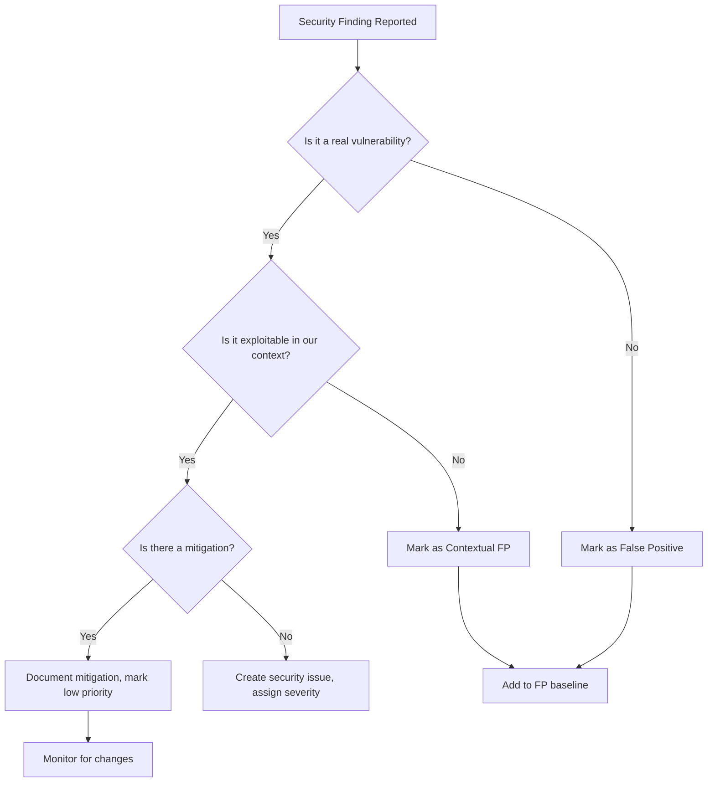

# BonkLM Security Issue Classification Scheme

> **Version**: 1.0.0
> **Last Updated**: 2026-02-21
> **Status**: Active

## INDEX

| Section | Description |
|---------|-------------|
| 1.0 | Severity Levels |
| 2.0 | False Positive Handling |
| 3.0 | Escalation Path |
| 4.0 | Classification Examples |
| 5.0 | CVSS Mapping |
| 6.0 | References |

---

## 1.0 Severity Levels

BonkLM uses a priority-based classification system (P0-P4) aligned with CVSS scores and practical remediation timelines. This system balances technical severity with business impact for a security-focused npm package.

### P0 - Critical

**Definition**: Vulnerabilities that allow complete system compromise, bypass core security guarantees, or expose sensitive data. These are "stop everything" issues that require immediate remediation.

**CVSS Score**: 9.0-10.0

**Response SLA**:
- Initial assessment: Within 1 hour
- Patch development: Within 4 hours
- Security advisory: Within 24 hours
- Public release: Within 48 hours

**Examples for BonkLM**:
- Prompt injection bypass that allows attackers to override all guardrails
- Secret exfiltration via output validation failure
- Remote code execution through connector integration
- Authentication bypass in wizard or CLI
- Path traversal allowing arbitrary file read/write
- Cryptographic failures exposing user data

**Action**: Block all releases, hotfix required immediately.

---

### P1 - High

**Definition**: Vulnerabilities that significantly impact security posture but have partial mitigations or require specific conditions to exploit. Core functionality is compromised but not completely bypassed.

**CVSS Score**: 7.0-8.9

**Response SLA**:
- Initial assessment: Within 4 hours
- Patch development: Within 24 hours
- Patched release: Within 72 hours

**Examples for BonkLM**:
- Jailbreak detection bypass for specific pattern categories
- Encoding evasion technique not covered by text normalizer
- DoS vulnerability causing service unavailability
- Information disclosure in error messages
- Missing validation on specific message content types
- Timeout bypass allowing resource exhaustion

**Action**: Include in next release, expedite if possible.

---

### P2 - Medium

**Definition**: Vulnerabilities with limited impact or requiring unlikely conditions. Security posture is reduced but not critically compromised.

**CVSS Score**: 4.0-6.9

**Response SLA**:
- Initial assessment: Within 24 hours
- Patch development: Within 7 days
- Patched release: Within 14 days

**Examples for BonkLM**:
- False negative in specific edge case patterns
- Minor information leakage (e.g., stack traces in dev mode)
- Race conditions with low exploitability
- Missing security headers in non-critical paths
- Dependency vulnerabilities with no known exploit
- Inefficient validation causing performance degradation

**Action**: Schedule for upcoming release, track in backlog.

---

### P3 - Low

**Definition**: Minor security issues with minimal practical impact. These represent defense-in-depth improvements rather than urgent fixes.

**CVSS Score**: 0.1-3.9

**Response SLA**:
- Initial assessment: Within 7 days
- Resolution: Within 30 days

**Examples for BonkLM**:
- Overly permissive CORS in example code (not production)
- Missing rate limiting (documented as user responsibility)
- Verbose logging in development mode
- Outdated dependencies with no known vulnerabilities
- Minor code quality issues flagged by linters

**Action**: Resolve when convenient, often during security sprints.

---

### P4 - Informational

**Definition**: Security observations, best practice recommendations, or potential issues that require monitoring but no immediate action.

**CVSS Score**: 0.0

**Response SLA**:
- Review: Within 30 days
- Action: As needed

**Examples for BonkLM**:
- Documentation improvements for security features
- Suggested enhancements to detection patterns
- New attack patterns to monitor (not yet exploited)
- Deprecated feature warnings
- Configuration hardening recommendations

**Action**: Add to security roadmap for consideration.

---

## Severity Comparison Table

| Priority | CVSS Score | Impact | Exploitability | Fix Timeline |
|----------|------------|--------|----------------|--------------|
| P0 | 9.0-10.0 | Complete compromise | Easy/Trivial | 24-48 hours |
| P1 | 7.0-8.9 | Significant impact | Moderate/Easy | 72 hours |
| P2 | 4.0-6.9 | Limited impact | Difficult/Moderate | 7-14 days |
| P3 | 0.1-3.9 | Minimal impact | Difficult | 30 days |
| P4 | 0.0 | None | None | As needed |

---

## 2.0 False Positive Handling

False positives in security tools (SAST, DAST, dependency scanners) must be handled systematically to maintain security posture without wasting resources.

### 2.1 False Positive Categories

| Category | Description | Example |
|----------|-------------|---------|
| **Tool FP** | Scanner reports non-existent issue | Regex pattern on comment string |
| **Contextual FP** | Real finding but not exploitable | Path traversal in client-side only code |
| **Mitigated FP** | Issue already addressed | Vulnerability in devDependency only |
| **Acceptable Risk** | Real issue, documented risk acceptance | Legacy dependency, no patch available |

### 2.2 False Positive Determination Process



### 2.3 False Positive Documentation

Every false positive MUST be documented with:

```markdown
## FP-XXX: [Scanner] Finding

**Finding**: [Scanner name and description]
**File**: [Affected file path]
**Rule**: [Rule ID or pattern]
**Rationale**: [Why this is a false positive]
**Context**: [Code context showing safety]
**Reviewer**: [Name and date]
**Validated By**: [Second reviewer, if required]
```

### 2.4 False Positive Baseline

Maintain a baseline of known false positives for automated tools:

**File**: `/team/security/false-positive-baseline.json`

```json
{
  "tool": "npm-audit",
  "version": "1.0.0",
  "lastUpdated": "2026-02-21",
  "exceptions": [
    {
      "id": "1234567",
      "package": "example-package",
      "reason": "Dev dependency only, not used in production",
      "expires": "2026-12-31"
    }
  ]
}
```

### 2.5 False Positive Review Requirements

| Severity | Single Reviewer | Secondary Review |
|----------|-----------------|------------------|
| P0 | Never | Always |
| P1 | Never | Recommended |
| P2 | Yes | No |
| P3 | Yes | No |
| P4 | Yes | No |

### 2.6 Re-evaluation Triggers

False positives must be re-evaluated when:
- Tool version is updated
- Code changes affect the finding context
- New exploit techniques are discovered
- Quarterly security review (at minimum)

---

## 3.0 Escalation Path

Escalation ensures critical security issues receive appropriate attention and resources.

### 3.1 Escalation Triggers

| Trigger | Severity | Timeline | Escalate To |
|---------|----------|----------|-------------|
| No initial assessment | P0 | 1 hour overdue | Security Lead |
| No patch in progress | P0 | 4 hours overdue | Engineering Lead |
| No patch released | P0 | 24 hours overdue | CTO |
| No response from assignee | P1 | 24 hours overdue | Security Lead |
| Disagreement on severity | Any | Immediately | Security Committee |
| External disclosure | P0-P1 | Immediately | CTO + Legal |

### 3.2 Escalation Contacts

```
Security Team Structure:
┌─────────────────────────────────────────────────────────┐
│                    CTO / Technical Lead                 │
│         [Escalation: P0 > 24h, External Disclosures]    │
└────────────────────────┬────────────────────────────────┘
                         │
┌────────────────────────┴────────────────────────────────┐
│                   Security Lead                         │
│    [Escalation: P0 > 1h, P1 > 24h, Severity Disputes]  │
└────────────────────────┬────────────────────────────────┘
                         │
┌────────────────────────┴────────────────────────────────┐
│              Engineering / Development Lead             │
│        [Escalation: P0 > 4h, Resource allocation]       │
└────────────────────────┬────────────────────────────────┘
                         │
┌────────────────────────┴────────────────────────────────┐
│                   Security Contributors                  │
│              [Issue triage, patch development]          │
└─────────────────────────────────────────────────────────┘
```

### 3.3 Escalation Procedure

1. **Initial Contact**: Message the assigned reviewer in the designated security channel
2. **Wait Period**: Allow appropriate time based on severity
3. **Escalation Message**: Include:
   - Issue ID and title
   - Severity level
   - Time elapsed
   - Impact if not addressed
   - Requested action
4. **Acknowledge**: Receiver must acknowledge within 30 minutes
5. **Action Plan**: Provide ETA and next steps within 1 hour

### 3.4 Emergency Escalation (P0 Only)

For P0 issues requiring immediate attention:

1. **Page** the Security Lead via designated emergency channel
2. **Assemble** emergency response team within 1 hour
3. **War room** created for real-time coordination
4. **Status updates** every 30 minutes until resolved

### 3.5 External Security Reports

When receiving vulnerability reports from external sources:

1. **Immediate acknowledgment** within 4 hours
2. **Verification** within 24 hours
3. **Bounty/credit determination** within 48 hours
4. **Coordinated disclosure** if vulnerability is confirmed
5. **Security advisory** publication per disclosure timeline

**External Disclosure Contact**:
- Email: security@blackunicorn.tech
- PGP Key: [To be published]
- Response SLA: 4 hours

---

## 4.0 Classification Examples

The following examples illustrate how to classify actual security issues in BonkLM.

### Example 1: Prompt Injection Bypass

**Issue**: Attacker can bypass all validators by using a specific Unicode encoding sequence.

**Classification**:
- **Severity**: P0 (Critical)
- **CVSS**: 9.1 (AV:N/AC:L/PR:N/UI:N/S:U/C:H/I:H/A:H)
- **Rationale**: Complete bypass of core security guarantee, trivial to exploit
- **Action**: Immediate patch, security advisory

---

### Example 2: Secret Leak in Log Output

**Issue**: API keys logged to console in verbose mode.

**Classification**:
- **Severity**: P2 (Medium)
- **CVSS**: 5.3 (AV:L/AC:L/PR:L/UI:N/S:U/C:L/I:N/A:N)
- **Rationale**: Requires local access, only in verbose mode, limited exposure
- **Action**: Fix in next release, add warning to docs

---

### Example 3: DoS via Large Input

**Issue**: Sending 10MB input causes validation to hang for 30 seconds.

**Classification**:
- **Severity**: P1 (High)
- **CVSS**: 7.5 (AV:N/AC:L/PR:N/UI:N/S:U/C:N/I:N/A:H)
- **Rationale**: Easy to exploit, affects availability, no data compromise
- **Action**: Expedite patch with input size limits

---

### Example 4: Outdated Dependency

**Issue**: Dependency has known vulnerability but not used in production code path.

**Classification**:
- **Severity**: P3 (Low)
- **CVSS**: 3.1 (original score)
- **Rationale**: Not exploitable, dependency only used in dev/test
- **Action**: Update when convenient, monitor

---

### Example 5: Missing Security Header

**Issue**: Example Express integration doesn't set Helmet headers.

**Classification**:
- **Severity**: P4 (Informational)
- **CVSS**: 0.0
- **Rationale**: Only in example code, not a library issue
- **Action**: Update documentation with best practices

---

### Example 6: False Positive - Path Traversal

**Issue**: SAST scanner reports `path.join(userInput, fileName)` as path traversal.

**Classification**:
- **Severity**: FP
- **Rationale**: User input is validated to be alphanumeric before use
- **Action**: Add to false positive baseline with code context

---

## 5.0 CVSS Mapping

BonkLM severity levels map to CVSS v3.1 scores as follows:

### CVSS v3.1 Severity Mapping

| BonkLM Priority | CVSS Score | CVSS Qualitative | CVSS Vector Examples |
|-----------------|------------|------------------|---------------------|
| P0 | 9.0-10.0 | Critical | AV:N/AC:L/PR:N/UI:N/S:C/C:H/I:H/A:H |
| P1 | 7.0-8.9 | High | AV:N/AC:L/PR:L/UI:N/S:U/C:H/I:H/A:H |
| P2 | 4.0-6.9 | Medium | AV:A/AC:H/PR:L/UI:N/S:U/C:L/I:L/A:N |
| P3 | 0.1-3.9 | Low | AV:L/AC:H/PR:H/UI:N/S:U/C:N/I:N/A:L |
| P4 | 0.0 | None | N/A |

### CVSS Metrics Interpretation

For BonkLM, emphasize the following CVSS metrics:

- **Attack Vector (AV)**: Network (N) > Adjacent (A) > Local (L) > Physical (P)
- **Attack Complexity (AC)**: Low (L) > High (H)
- **Privileges Required (PR)**: None (N) > Low (L) > High (H)
- **User Interaction (UI)**: None (N) > Required (R)
- **Scope (S)**: Changed (C) > Unchanged (U)
- **Impact (C/I/A)**: High (H) > Low (L) > None (N)

**BonkLM-Specific Adjustments**:

1. **Upweight** impact on guardrail bypass (C/I/A = H)
2. **Downweight** issues requiring authenticated user access (PR = H)
3. **Upweight** vulnerabilities exploitable via LLM prompts (UI = N)
4. **Upweight** issues affecting multiple connectors (S = C)

---

## 6.0 References

### External Standards

- **CVSS v3.1 Specification**: https://www.first.org/cvss/specification-document
- **OWASP Risk Rating**: https://owasp.org/www-community/OWASP_Risk_Rating_Methodology
- **OWASP LLM Top 10**: https://owasp.org/www-project-top-10-for-large-language-model-applications/
- **CWE Top 25**: https://cwe.mitre.org/top25/
- **NIST Cybersecurity Framework**: https://www.nist.gov/cyberframework

### NPM Security Best Practices

- **npm Security**: https://docs.npmjs.com/cli/v9/commands/npm-audit
- **Node.js Security Best Practices**: https://nodejs.org/en/docs/guides/security/
- **npm Package Security Best Practices**: https://github.com/anthonyfcaronz/nodejs-security-best-practices

### Internal Documents

- [Security Audit Plan](/team/security/security-audit-plan.md)
- [Security Review Checklist](/team/qa/code-review-checklist.md)
- [Incident Response Plan](/team/security/incident-response-plan.md)
- [Lessons Learned](/team/lessonslearned.md)

---

## Appendix A: Quick Reference Card

```
BONKLM SECURITY CLASSIFICATION QUICK REFERENCE

┌────────────────────────────────────────────────────────────────────┐
│  P0  │ CRITICAL     │ CVSS 9.0-10.0 │ Fix: 24-48 hours              │
│      │              │               │ Action: Block all releases    │
├────────────────────────────────────────────────────────────────────┤
│  P1  │ HIGH         │ CVSS 7.0-8.9  │ Fix: 72 hours                 │
│      │              │               │ Action: Expedite release      │
├────────────────────────────────────────────────────────────────────┤
│  P2  │ MEDIUM       │ CVSS 4.0-6.9  │ Fix: 7-14 days                │
│      │              │               │ Action: Next release          │
├────────────────────────────────────────────────────────────────────┤
│  P3  │ LOW          │ CVSS 0.1-3.9  │ Fix: 30 days                  │
│      │              │               │ Action: Backlog               │
├────────────────────────────────────────────────────────────────────┤
│  P4  │ INFO         │ CVSS 0.0      │ Fix: As needed                │
│      │              │               │ Action: Roadmap               │
└────────────────────────────────────────────────────────────────────┘

FALSE POSITIVE HANDLING:
1. Document rationale in /team/security/false-positive-baseline.json
2. Re-evaluate on tool updates or code changes
3. P0/P1 require secondary review for FP determination

ESCALATION:
- P0 > 1hr without assessment → Security Lead
- P0 > 4hr without patch → Engineering Lead
- P0 > 24hr without release → CTO
- External report → Immediate CTO notification

CONTACTS:
- Security Team: security@blackunicorn.tech
- Emergency Response: [To be defined]
- PGP Key: [To be published]
```

---

## Change History

| Date | Version | Changes | Author |
|------|---------|---------|--------|
| 2026-02-21 | 1.0.0 | Initial classification scheme | Security Research Agent |
